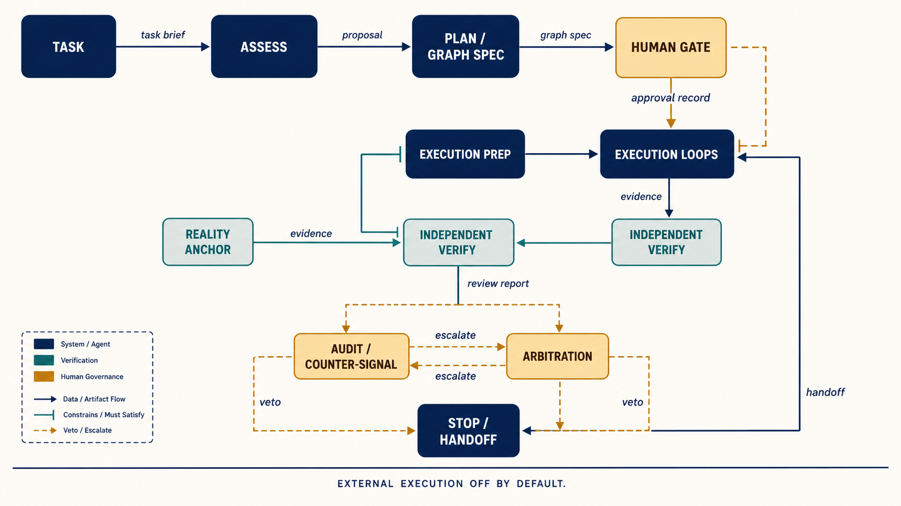
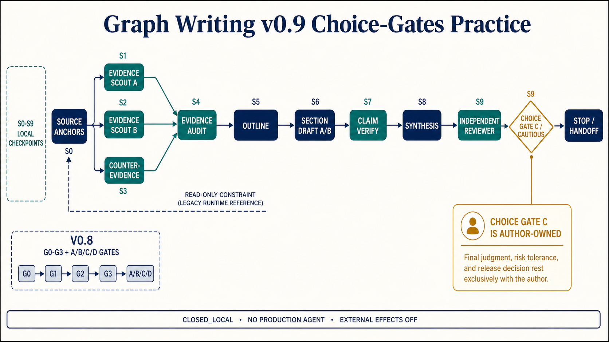

# Graph Engineering Agent Builder

> 把模糊任务转化为可评估、可规划、可审查、可授权执行的 Agent Graph。

**MVP 状态：已本地验证** · **13 个自动化测试** · **外部执行默认关闭** · **包含真实 v0.9 写作工程案例**

Graph Engineering Agent Builder 是一个“推理型总控 Skill + 确定性本地工具”项目：先判断任务是否值得建 Graph，再评估方案、生成可审查的 Graph Spec，最后在明确授权后准备执行。它把节点、边、现实锚点、独立验证、成本预算、人工门禁和 stop/handoff 固化为可验证契约。

它不是一个默认替用户执行任务的 Agent 集群，也不会因为 Mock Executor 成功就宣称现实任务完成。

## 它解决什么问题

普通的多 Agent 编排往往从“再加一个 Agent”开始，结果是职责重叠、边界隐含、验证者复用同一份被优化过的数据，最后只能依据 Agent 自己的报告宣布成功。Builder 把控制问题提前到执行之前：先判断是否真的需要 Graph，再定义证据如何流动、谁可以否决、什么时候必须停下并交接。

它的核心价值不是 Agent 数量，而是让每一个关键关系都可以回答三个问题：

1. 传递的具体 artifact 或 evidence 是什么？
2. 接收者是被输入、被约束、被验证，还是被否决？
3. 这条边如何避免共享来源造成的循环确认？

## 为什么它比普通多 Agent 编排更有优势

| 维度 | 常见做法 | Graph Engineering Agent Builder | 可核查依据 |
|---|---|---|---|
| 任务入口 | 直接拆成多个 Agent | 先分类 `direct / loop / workflow / graph / blocked` | `scripts/initialize.py` |
| 协作关系 | “互相协作”或共享上下文 | 每条边声明关系和 artifact | `graph-spec.md` |
| 质量判断 | Agent 自报完成或互相复述 | fresh-independent 验证者 + 冻结现实锚点 | Graph Spec 规则、测试 |
| 权限控制 | 批准方案后默认继续执行 | Human Gate 独占目标、权限和冻结规则 | `SKILL.md`、`execution_contract` |
| 失败处理 | 继续重试或增加 Agent | 预算、失败传播、veto、stop/handoff | Mock Executor、运行报告 |
| 可复现性 | 依赖一次对话 | 确定性初始化、校验器和本地模拟 | `make verify` |

这些是结构能力，不等于自动产生更高质量的论文或业务结果；现实结果仍需要领域证据和人类判断。

## 项目总览



上图按 `graph-engineering-architect` 的设计原则组织：执行回路产生候选，独立验证者使用 fresh-independent 上下文检查，现实锚点提供不能被执行回路改写的证据，audit / counter-signal 与 arbitration 负责发现漂移和冲突，Human Gate 持有目标、权限和冻结规则的最终权力。

精确的可编辑拓扑源文件见 [`docs/architecture.dot`](docs/architecture.dot)，渲染版本见 [`assets/architecture-exact.svg`](assets/architecture-exact.svg)。

## 四阶段工作流

| 阶段 | Builder 负责什么 | 典型产物 |
|---|---|---|
| 1. 任务判断 | 将请求分类为 `direct`、`loop`、`linear_workflow`、`graph`、`graph_plus_loop` 或 `blocked` | Task Brief |
| 2. 方案评估 | 比较最小方案与 Graph 方案，检查独立性、假边、成本、风险和权限 | Proposal / risk notes |
| 3. 详细规划 | 写入根目标、节点契约、真实边、现实锚点、预算、失败策略和交接 | Graph Spec |
| 4. 授权执行 | 只有人类明确批准后才进入 `ready` / `executing`；持续记录证据、失败、成本和交接 | Approval record / run report / handoff |

节点表示职责，不默认等于一个 Agent。每条边都必须说明关系和传递的 artifact；“协作”“沟通”这类模糊边不够作为控制契约。

## 什么时候使用，什么时候不要使用

| 任务信号 | 推荐模式 | 原因 |
|---|---|---|
| 一次性、边界清楚、没有有价值的反馈回路 | `direct` | Graph 的治理成本高于收益 |
| 一个主目标、一个可信验证者、有限重试 | `loop` | 先把状态、预算和停止逻辑做成单回路 |
| 多个职责、证据来源不同、目标可能冲突或指标容易被利用 | `graph` | 需要独立验证、锚点、仲裁和人类门禁 |
| Graph 中某些节点还需要持久迭代、恢复和独立预算 | `graph_plus_loop` | Graph 管关系，Loop 管节点内部状态 |
| 根目标、权限、验收或现实锚点仍不清楚 | `blocked` | 先补齐人类拥有的决策，不猜测执行 |

不要因为有多个步骤、多个工具或多个模型就自动建 Graph。Graph 的门槛是相互作用的控制责任，而不是组件数量。

## 能力与证据状态

| 能力 | 当前状态 | 证据 / 限制 |
|---|---|---|
| 任务判断与 Graph 初始化 | 已实现 | `valid-task-brief.json`、初始化器测试 |
| 节点、边、锚点、预算和权限契约 | 已实现 | Graph Spec 校验器 |
| 独立验证与现实锚点约束 | 已实现 | `fresh-independent`、`frozen: true` 规则 |
| 拓扑批次、失败传播和报告 | 已实现（本地模拟） | Mock Executor；不创建真实 Agent |
| v0.9 Graph Writing 实践 | 已完成本地案例 | S0–S9、Reviewer、`closed_local` |
| 生产 Agent runtime / 外部效果 | 未提供 | 需要单独设计、授权和真实环境验证 |
| 质量提升、成本下降、可复现实验结论 | 未声称 | 当前没有统计实验或生产遥测 |

## 已实际运行的案例：Graph Writing v0.9

本项目已用于设计和审查独立的 [Academic Research Graph Writing v0.9 Choice-Gates 工作流](https://github.com/2023Anita/academic-research-loop-workflow/tree/main/academic-research-graph-writing-v0.9-choice-gates)，并随 [v0.9.0 GitHub Release](https://github.com/2023Anita/academic-research-loop-workflow/releases/tag/v0.9.0-graph-writing-choice-gates) 发布。原仓库的 v0.8 运行时没有被覆盖；v0.9 是新增的写作工程扩展。



这次实践中的 Graph 路径是：

```text
source anchors
  -> evidence scout A / evidence scout B / counter-evidence
  -> evidence audit
  -> outline
  -> section drafting A/B
  -> claim verification
  -> synthesis
  -> independent Reviewer
  -> author Choice Gate C (cautious)
  -> stop / handoff
```

实际记录包括：

- S0–S9 本地 checkpoint、来源清单、Graph Spec、handoff 和 Reviewer reports；
- `C / cautious` 作者选择，以及 `closed_local` 的本地收束状态；
- v0.8 的 G0–G3 与 A/B/C/D 门禁作为只读约束；
- 原 v0.8 Skill、目录和安全边界保持不变；
- 实践只证明本地证据链收束，不声称生产 Agent、最终论文、质量/成本实验或外部发布完成。

| 案例环节 | 实际输入 | 实际输出 |
|---|---|---|
| 任务判断 | Graph Engineering 写作任务简报 | `graph_plus_loop` 方向与边界 |
| 方案与规划 | 来源锚点、作者模式、v0.8 G0–G3 约束 | Graph Spec、review plan、预算和 handoff |
| 执行准备 | 证据侦察、审计、起草和核验节点 | S0–S9 checkpoint 链与 Reviewer reports |
| 决策收束 | 作者选择 `C / cautious` | `closed_local`，外部执行仍为 unauthorized |

可直接查看案例的 [Graph Spec](https://github.com/2023Anita/academic-research-loop-workflow/blob/main/academic-research-graph-writing-v0.9-choice-gates/examples/practice-graph-engineering-writing/graph-spec.json)、[S9 Reviewer 报告](https://github.com/2023Anita/academic-research-loop-workflow/blob/main/academic-research-graph-writing-v0.9-choice-gates/reviews/s9-independent-review-report-v2.json) 和 [v0.9 Release](https://github.com/2023Anita/academic-research-loop-workflow/releases/tag/v0.9.0-graph-writing-choice-gates)。

详细案例说明见 [`docs/case-study-v0.9.md`](docs/case-study-v0.9.md)，精确拓扑源文件见 [`docs/graph-writing-v09.dot`](docs/graph-writing-v09.dot)。

## 快速开始

```bash
python3 scripts/initialize.py examples/valid-task-brief.json /tmp/graph-builder-demo
python3 scripts/validate_graph.py /tmp/graph-builder-demo/graph-spec.json
make verify
```

初始化器拒绝已存在的输出目录，避免覆盖成果。可以复制并修改 `examples/valid-task-brief.json` 作为任务简报。

## 全局安装这个 Skill

项目内置的自包含 Skill 位于 `skills/graph-engineering-agent-builder/`。从仓库根目录安装到当前 Codex 的全局 Skills 目录：

```bash
SKILL_HOME="${CODEX_HOME:-$HOME}/.codex/skills/graph-engineering-agent-builder"
mkdir -p "$(dirname "$SKILL_HOME")"
cp -R skills/graph-engineering-agent-builder "$SKILL_HOME"
python3 "${CODEX_HOME:-$HOME}/.codex/skills/.system/skill-creator/scripts/quick_validate.py" "$SKILL_HOME"
```

安装只复制 Skill 说明、引用和确定性脚本，不复制项目数据、对话、凭证或 `.workflow` 状态。更新版本时应重新审查后再复制，避免无意覆盖本地改动。

## Mock Executor 的边界

```bash
python3 scripts/mock_executor.py examples/approved-graph.json /tmp/graph-builder-run
```

Mock Executor 只验证已批准 Graph 的拓扑批次、失败传播和运行报告：不创建真实 Agent、不调用模型或网络，也不执行领域任务。报告的成功状态只能是 `simulated_success`，并固定写入 `domain_completion_claimed: false`。

## 与其他组件的分工

- [`graph-engineering-architect`](https://github.com/2023Anita/graph-engineering-architect)：判断 Graph 是否合理，设计拓扑、现实锚点、治理和跨回路约束。
- `loop-engineering-co-builder`：负责单个持久迭代节点内部的状态、恢复、预算和停止逻辑。
- Graph Engineering Agent Builder：把任务判断、方案评估、Graph Spec 生成、确定性校验和执行准备物串成一条可审查路径。
- [`academic-research-loop-workflow`](https://github.com/2023Anita/academic-research-loop-workflow)：提供 v0.8 Choice-Gates 运行时；本项目只读使用其边界，不替换它。

## 路线图：下一步要验证什么

### 已完成

- 四阶段任务判断、方案评估、规划和授权执行准备；
- Graph Spec 初始化、结构校验和错误报告；
- 本地 Mock Executor 的批次调度、失败传播和 handoff；
- Graph Writing v0.9 的真实本地实践与独立 Reviewer 记录；
- 可安装 Skill、专业架构图和可编辑 Graphviz 拓扑源文件。

### 下一步

- 为真实 Agent adapter 定义最小权限和证据接口；
- 增加成本遥测，将预算估算与实际 token / tool cost 分开记录；
- 补充负向 fixture、recovery、handoff 和跨机器复现测试；
- 在获得明确授权的隔离环境中评估外部执行边界。

### 明确不把它写成已完成

本仓库目前不是生产级自治系统，不承诺自动投稿、自动发布、自动修改安全规则，也没有用现有案例证明“质量更高”或“成本更低”。这些都必须经过独立实验、真实证据和人类批准。

## 安全边界

- 根目标、现实锚点、权限和冻结规则必须由人类拥有。
- Graph 模式必须有独立验证者、独立且冻结的现实锚点、人类门禁和可用的 stop/handoff。
- 删除、提交、推送、发布、上传、生产写入、敏感数据出站和权限扩大必须单独确认。
- `execution_contract.external_execution` 默认关闭；批准 Graph 设计不等于批准外部动作。
- 结构验证只能证明契约完整，不能证明锚点真实独立或现实任务已经完成。

## 图示制作说明

图示先依据 `graph-engineering-architect` 的节点/边/锚点/治理约束建模，再按 `scientific-infographic` 的学术信息图规范生成视觉稿；同时保留 Graphviz `.dot` 源文件，便于审查和重新渲染。图片是解释性工程文档，不替代运行契约或安全规程。

图示来源与制作边界记录在 [`docs/visual-provenance.md`](docs/visual-provenance.md)。
